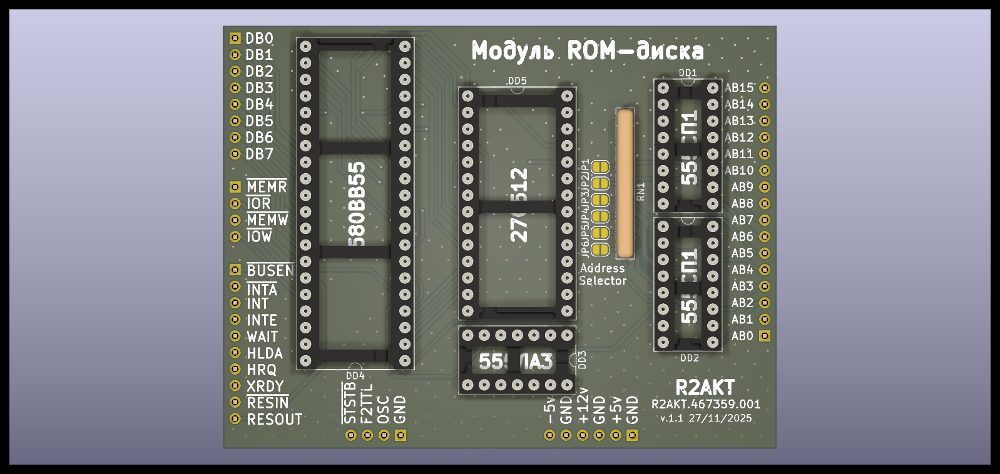

License addendum - https://github.com/R2AKT/ROM_Disk/blob/main/Addendum.txt
# ROM_Disk

ROM disk board. For connecting to the CPU_8080 processor board - https://github.com/R2AKT/CPU_8080.

Based on ROM-disk for RADIO-86RK.

Плата ROM-диска. Для подключения к процессорной плате CPU_8080 - https://github.com/R2AKT/CPU_8080.

На основе ROM-диска для РАДИО-86РК.
