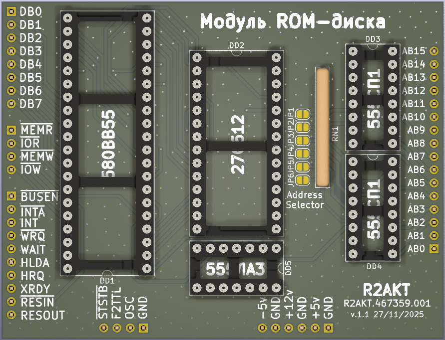

License addendum - https://github.com/R2AKT/ROM_Disk/blob/main/Addendum.txt
# ROM_Disk

ROM disk board. For Mega-80 (Mega-580) DIY 8-bit micro-computer - https://github.com/R2AKT/Mega-80.

Based on ROM-disk for RADIO-86RK.

Плата ROM-диска. Для самодельной 8-битной микро-ЭВМ - https://github.com/R2AKT/Mega-80.

На основе ROM-диска для РАДИО-86РК.
